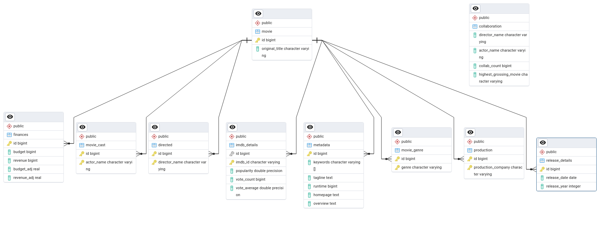
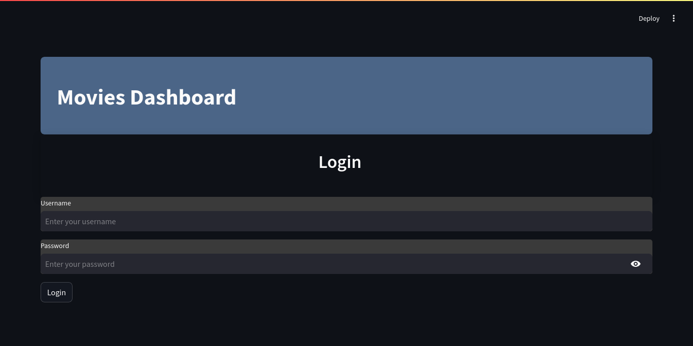

# [Movies Dashboard](https://github.com/gowthamgeddam/DE_Project) (Project Report)

> DS5003A Data Engineering

## Team Details

|Name|Roll No.|
|:---:|:---:|
|142402001|Adarsh G|
|142402006|Geddam Gowtham|
|142402012|Suman Pal|

## Problem Description

+ Analyze a CSV file containing detailed information about movies, including metadata such as titles, genres, cast, directors, budget, revenue, and release dates.
+ Extract meaningful insights from the dataset.
+ Design relational database schema to store the movie data.
+ Develop a dashboard with different user roles to connect to the designed database and visualize various aspects of the data.

---

## Key Implementation

### Data Preprocessing

+ To start with the project, first preprocessing the given dataset is done using jupyter notebook
+ **Libraries used:** pandas
+ Pandas is used to read csv data and turn it into dataframe and all the successive processing are done on that dataframe.
+ **Handling null values:**  
  + `nan` values in actor names, director names, production company names have been removed.
  + `0` values in budget and revenue are unaltered since some of the database queries depend on it. Instead those movies were ignored in such queries.
+ **Data Formatting:**
  + To insert values into our Database, they need to be of matching datatype and format should be considered (eg: `Date: YYYY-MM-DD`)
  + Once we decided on Database Schema, we formatted each column to required format for us to insert into our database.

---

### Database Schema

+ PostgreSQL, pgAdmin is used to design and implement relational database schema.
+ The whole movie dataset is divided into 9 tables:
  + **movie** (**id** bigint, **original_title** character varying, **PRIMARY KEY** (id))
  + **imdb_details** (
      **id** bigint,
      **imdb_id** character varying ,
      **popularity** double precision,
      **vote_count** bigint,
      **vote_average** double precision,
      **PRIMARY KEY** (imdb_id) )
  + **movie_genre**(
      **id** bigint ,
      **genre** character varying ,
      **PRIMARY KEY** (id, genre)
  )
  + **release_details**(
      **id** bigint ,
      **release_date** date,
      **release_year** integer,
      **PRIMARY KEY** (id)
  )
  + **finances**(
      **id** bigint ,
      **budget** bigint,
      **revenue** bigint,
      **budget_adj** real,
      **revenue_adj** real,
      **PRIMARY KEY** (id)
  )
  + **metadata**(
      **id** bigint ,
      **keywords** character varying[],
      **tagline** text,
      **runtime** bigint,
      **homepage** text,
      **overview** text,
      **PRIMARY KEY** (id)
  )
  + **directed**(
      **id** bigint ,
      **director_name** character varying,
      **PRIMARY KEY** (id, director_name)
  )
  + **movie_cast**(
      **id** bigint ,
      **actor_name** character varying ,
      **PRIMARY KEY** (id, actor_name)
  )
  + **production**(
      **id** bigint ,
      **production_company** character varying,
      **PRIMARY KEY** (id, production_company)
  )
+ Data values are inserted from the export files created in preprocessing.
+ Additional function are added for query retrieval to be used from dashboard.

### Dashboard

+ Streamlit is used to create the dashboard
+ Their is a login page, which allows for two types of users: **admin** and **user**.
+ **User** role has access to user dashboard.
+ User dashboard has 5 pages:
  + `Home`: Contains basic stats about the database
    (Eg: `Total movies`, `Total directors`, `Total Actors`)
  + `Page 1`, `Page 2`, `Page 3` : Contains all the 10 queries that were part of project description
  + `Page 4`: Contains 5 functions that user can use.
    + Get Movie Details giving (input: Movie Name)
    + Get Actor's Highest Grossing Movie (input: actor name)
    + Get Movie Director (input: Moive name)
    + Count Movies by Year (inpput: Year)
    + Genre by Movie Name (input: Movie name)
+ **Admin** role has access to admin dashboard.
  + Admin page contains Home page similar to user dahsboard.
  + And it have 10 other pages
  + First 9 pages, each shows data from 9 respective tables and ability to add new row to the repsective table (contains a form and `add detials` button). There is a refresh button to refresh the data shown
  + 10th page is to add all the details of the movie at once.

### Demo

#### Login Page

#### User Dashboard

#### Admin Dashboard

## Individual Contributions

+ **Adarsh G**: queries (last 5), streamlit setup, user dashboard
+ **Geddam Gowtham**: preprocessing (formatting), database setup, admin dashboard
+ **Suman Pal**: preprocessing, queries (first 5), functions

### Github Repository : [Movie dashboard DE Project](https://github.com/gowthamgeddam/DE_Project)